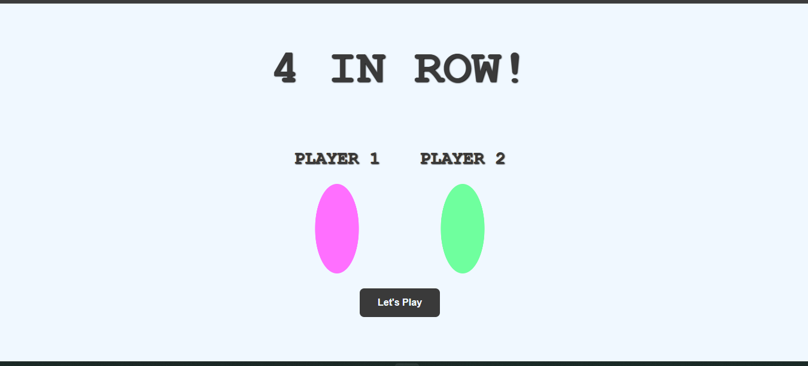
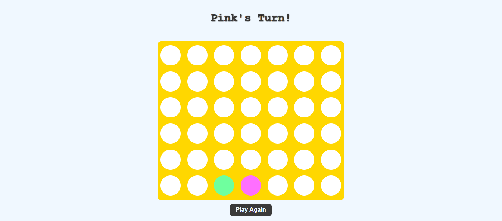

# 4 In Rows

## Date: 9/11/2025

### By: Hawra Alaam

#### [GitHub](https://github.com/HawraAlaam) | [LinkedIn](https://www.linkedin.com/in/hawra-alaam-40a2a3331/)
***
### ***Description***
#### Four in a Row, is a two-player strategy game where players take turns dropping colored discs into a vertical grid. The objective is to be the first player to get four of their own colored discs in a continuous line, either horizontally, vertically, or diagonally, within the grid. Players must strategically block their opponent's attempts to connect four while working to build their own line of four.
***

### ***Technologies***
* HTML
* CSS
* JS

***
### ***Getting Started***
##### Sign up and sign in as a new user and then begin viewing the different sections of the website.
##### A Trello board was used to keep track of development progress and can be viewed [https://github.com/HawraAlaam/FourInRow.git](URL).
##### The project was deployed and can be viewed [here](moaning-cause.surge.sh).
***
### ***Screenshots***
##### Page 1

##### Page 2

##### Page1 New

##### Page2 New

***
### ***Future Updates***
- [x] Annimation
- [] Sounds
***
### ***Credits***
Markdown Guide: [ia.net](https://ia.net/writer/support/basics/markdown-guide)
Markdown Cheatsheet: [GitHub](https://www.markdownguide.org/cheat-sheet/)
Winning Arrays : [GitHub](https://github.com/kubowania/connect-four/blob/master/app.js)

